[](https://travis-ci.org/tsukuba-pbl/16-4_PosTom)

# PosTom
　PosTomは、展示会向けwebアプリ作成支援ツールです。
ポスター発表を含む学会を対象とし、ポスター配置をwebブラウザ上で配置することができます。


## PosVote
　平成28年度では、PosTom にはなかったオフライン投票システムを追加しました。

### 関連するGitHubのレポジトリ
 - [投票先の集計機のプロジェクト](https://github.com/tsukuba-pbl/16_4_Android)

## 概要
　展示会などを含む学会のためのスマートフォン向けWebアプリ「PosMApp」はDEIM2015をはじめとする様々な学会で利用されてきました。
　実際の利用を経て、多くの方々から「他の学会で利用したい」との要望があったが、現在のPosMAppを他の学会で利用しようとする際には、コード変更などの専門的な作業が必須でした。
　そこで、我々はPosMAppを各イベントごとに簡単に作成できるようなWebアプリ「PosTom」を開発しました。
　PosTomを利用することにより、ポスターセッション・タイムテーブル・プレゼンテーション一覧のコンテンツを簡単に作成することができ、CSVファイルの一括登録やドラッグアンドドロップによる直感的な操作により、学会向けWebアプリ作成の労力を大幅に削減が可能となりました。また、PosMAppとPosTomに投票機能を追加することにより、学会で紙投票していたところを簡単に投票可能となりました。
　

## システム要件
PosTomはCakePHP 2.xを使用して開発されております。
そのためシステム要件には[CakePHP 2.x のシステム要件](http://book.cakephp.org/2.0/ja/installation.html#id2)に準拠することが求められます。

* HTTP サーバー (Apache推奨)
* PHP 5.3.0 以上
* MySQL 4 以上


## 動作環境
以下のブラウザ・バージョンで動作できることを確認しております。

* Google Chrome 40 以上
* Firefox 40 以上
* Safari 9 以上


## サービスの設置方法
ここでは、githubリポジトリの取得からサービス開始までの手順を説明します。

### Step.1 GitHubからソースを取得
事前にgitをインストールしておくこと。
```
git clone https://github.com/tsukuba-pbl/16-4_PosTom.git
```

### Step.2 プロジェクトフォルダの権限を設定
```
chmod -R 755 プロジェクト名
```

### Step.3 .gitignoreされているtmpフォルダを生成
```
cd プロジェクト名/app/
mkdir tmp
```

### Step.4 .gitignoreされているtmpフォルダの権限を設定
```
chmod -R 755 tmp
```

### Step.5 .gitignoreされているtmpファルダ内のemptyファイルを個別生成
```
cd tmp && mkdir cache && mkdir logs && mkdir sessions && mkdir tests && cd cache && mkdir models && mkdir persistent && mkdir views && touch models/empty && touch persistent/empty && touch views/empty && cd ../ && touch logs/empty && touch sessions/empty && touch tests/empty
```

### Step.6 databaseファイルの複製
```
cd ../Config/
cp database.php.default database.php
```

### Step.7 databaseファイルの編集
```
class DATABASE_CONFIG {
	public $default = array(
		'datasource' => 'Database/Mysql',
		'persistent' => false,
		'host' => '[データベースホスト名]',
		'login' => '[ユーザー名]',
		'password' => '[パスワード]',
		'database' => '[データベース名]',
		'prefix' => '',
		'encoding' => 'utf8',
	);
	public $test = array(
		'datasource' => 'Database/Mysql',
		'persistent' => false,
		'host' => '[データベースホスト名]',
		'login' => '[ユーザー名]',
		'password' => '[パスワード]',
		'database' => '[データベース名]',
		'prefix' => '',
		'encoding' => 'utf8',
	);
}
```

以上で、ファイルやフォルダ構成の準備が整いました。

次に、データベースの設定をおこないます。

## データベース準備
ここでは、データベースにサービスで必要なテーブルの追加をおこないます。

まずは、SSHでサービスを設置したサーバに接続し、MySQLを起動し、使用するデータベースを選択したところから以下を初めてください。

### リポジトリに含まれているinit.sqlファイルを実行
SQLファイルまでのパスは各自で入力してください。

```
mysql > SOURCE /xxxxxxxxxxxx/init.sql
```

### テーブルが挿入されたことを確認
```
mysql > show tables;
```

以下のように表示されればデータベースの準備が完了です。

```
+------------------------------+
| name_of_database             |
+------------------------------+
| areas                        |
| authors                      |
| commentators                 |
| disuses                      |
| editors                      |
| events                       |
| posters                      |
| presentations                |
| rooms                        |
| schedules                    |
| test                         |
| users                        |
+------------------------------+
12 rows in set (0.00 sec)
```

## 使用マニュアル
ここでは一通り、学会用スマートフォン向けWebアプリ「PosMApp」を生成するための手順を説明します。

PosTom利用マニュアル動画を配信しています。

[](https://www.youtube.com/watch?v=pQ8oD7f7RKU)

PosMAppを生成するには以下の手順をおこないます。

1. アカウント作成
2. ログイン
3. イベント作成
4. スケジュール
5. プレゼンテーション
6. ポスター
7. フロアマップ
8. セッティング
9. PosMAppで確認

以降、この手順に従って説明していきます

### 1. アカウント作成
アカウントをつくらなければ何も始まりません。

ランディングページ下部のアカウント作成フォームを入力し「**Sign Up**」ボタンを押します。

すべて必須項目となります


アカウント作成が完了すると、ページが遷移し以下のようなメッセージが表示されます

> Email was sent.
Registration is not yet complete.
Please check your email, and please finish registration.

フォームに入力したメールアドレス宛に**本登録用アドレス**を記載したメールを送ったことを示しています。

メールを受け取り、本文に記載されている**本登録用アドレス**にアクセスします。

以下のようなメッセージが表示されれば、本登録完了です。

> Registration was completed


### 2. ログイン
さっそくログインしてみましょう。

ランディングページの上部、または本登録完了ページの上部から「**Sign In**」を押してログインページに遷移します。


ページ上部に

> Welcome to PosTom [ユーザー名] !!

と表示されればログイン成功です。


### 3. イベント作成
さっそくイベントを作成していきましょう。

アカウント登録直後は何もイベントが作成されていないため、以下のように表示されていると思います。

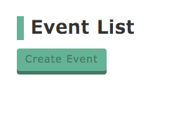

イベントを生成していくと、こちらにイベントリストとして表示されていきます。

ここに表示されている「**Create Event**」ボタンを押すことでイベントを生成することができます。

「**Create Event**」ボタンを押すと、イベント作成ページに遷移します。

各項目を入力していきます。上からイベント名, イベント開催場所, イベント開始日時, イベント終了日時

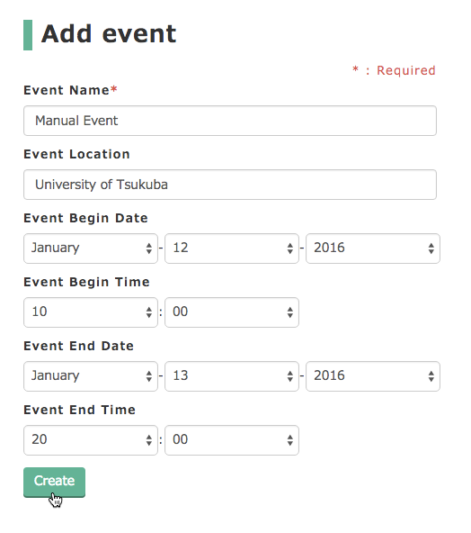

※イベント開催日数は10日間以内です。

イベントの作成が完了すると、イベントリストにさきほど作成したイベントが表示されます。


イベントを押すと、イベントのトップページ（以降、ダッシュボードページ）に遷移します。

以下のページが、ダッシュボードページになります。

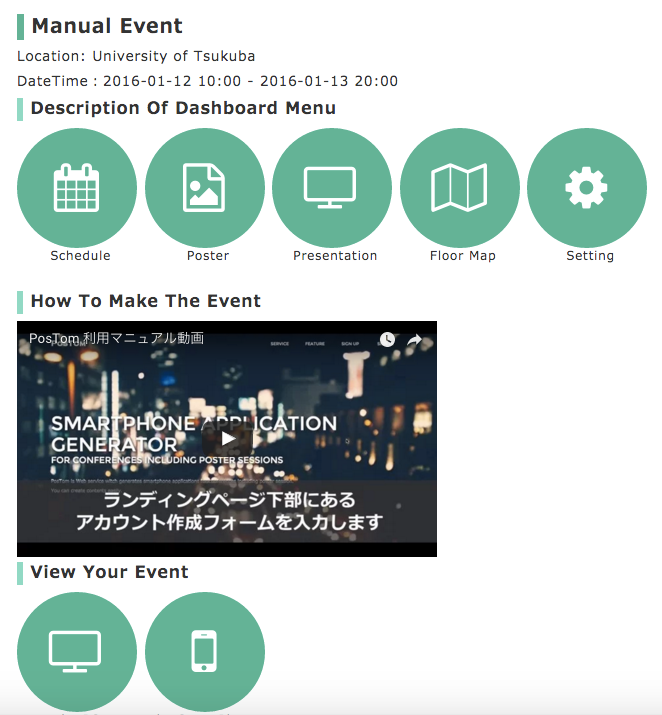

イベントを押すと、サイドバーを利用することが可能になります。

以下の状態が、サイドバーが利用できる状態です。


ダッシュボードページでは、以下のような操作がおこなえます。

* 各サイドバーにおける説明閲覧
* PosMApp作成ガイド動画の視聴
* PosMAppでの動作確認

### 4. スケジュール
イベントの作成が完了したら、イベントのスケジュールを編集しましょう。

サイドバーの「**Schedule**」を押します。

スケジュールとはタイムテーブルのようなものです。

イベント作成直後は、何もスケジュールには登録されていません。

スケジュールを登録する方法は、

1. CSVファイルによる一括登録
2. 個別入力登録

の2つの方法があります。

スケジュールを登録する前に、セッションという概念について理解する必要があります。

詳しくは、辞書を参照ください。

タイムテーブルは複数のセッションで構成され、1つのセッションは複数のプレゼンテーションから構成されます。

簡単にいうと、同じカテゴリに分類できるプレゼンテーションをひとまとまりにしたものをセッションと理解しておいてください。

セッションはある部屋である時間帯でおこなわれるものです。これから登録していくものは、このセッションにあたります。

#### 1. CSVファイルによる一括登録
「**Add Session From CSV File**」ボタンを押し、あらかじめ用意しておいたCSVファイルを選択します。

ファイルを選択すると、自動的にファイルがアップロードされ、エラーが存在すればエラーの箇所を確認することができます。

何も問題がなければ自動的に保存されます。

登録が完了すると、以下のようにタイムテーブルの形式で表示されます。

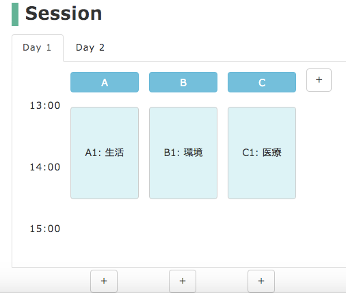

#### 2. 個別入力登録
画面上の「**+**」ボタンを押し、ルームを追加します。


ルーム名を入力して「**Save**」ボタンを押します。

ボタンを押すと、ルームが追加され、追加したルームの下に「**+**」ボタンを押し、セッションを追加します。

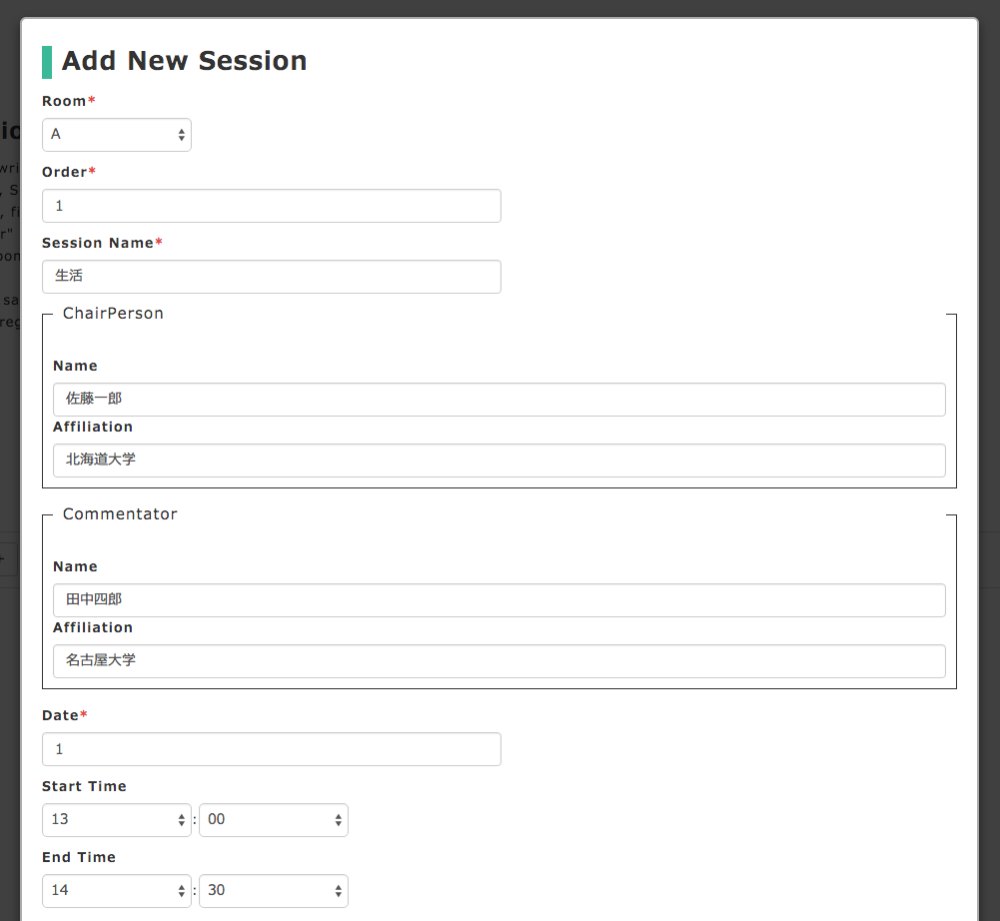

セレクトボックスからルームを選択し、オーダーなどの各項目を入力して「**Save**」ボタンを押します。

タイムテーブル上に登録できれば個別入力登録の完了です。


### 5. プレゼンテーション
続いて、イベントのプレゼンテーションを編集しましょう。

サイドバーの「**Presentation**」を押します。

プレゼンテーションとは口頭発表のことを指します。

イベント作成直後は、何もプレゼンテーションには登録されていません。

プレゼンテーションを登録する方法は、スケジュールと同様に

1. CSVファイルによる一括登録
2. 個別入力登録

の2つの方法があります。

#### 1. CSVファイルによる一括登録
「**Add Presentation From CSV File**」ボタンを押し、あらかじめ用意しておいたCSVファイルを選択します。

ファイルを選択すると、自動的にファイルがアップロードされ、エラーが存在すればエラーの箇所を確認することができます。

何も問題がなければ自動的に保存されます。

登録が完了すると、以下のようにリストの形式で表示されます。


#### 2. 個別入力登録

画面上の「**+**」ボタンを押し、プレゼンテーションを追加します。

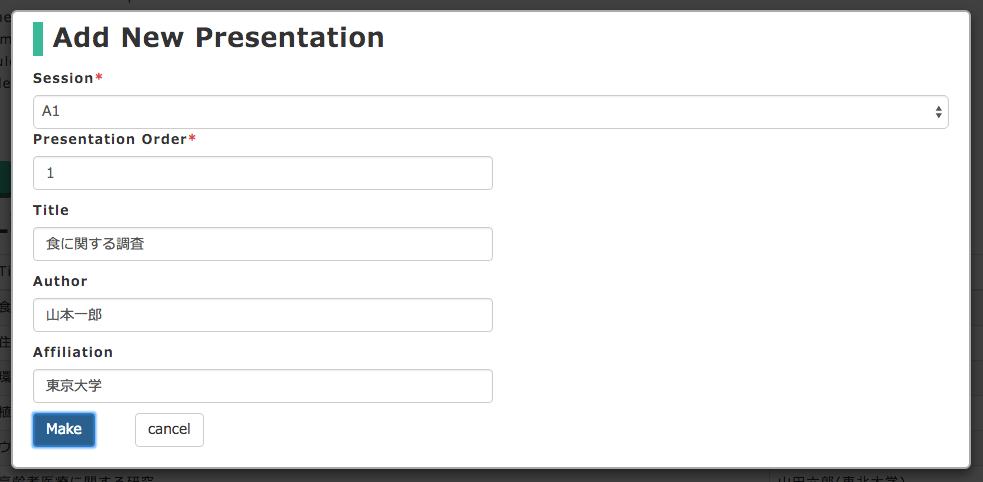

セレクトボックスからセッションを選択し、プレゼンテーションオーダーなどの各項目を入力して「**Save**」ボタンを押します。

プレゼンテーションリスト上に登録できれば個別入力登録の完了です。


### 6. ポスター
続いて、メインとなるポスターを編集しましょう。

サイドバーの「**Poster**」を押します。

学会におけるポスターセッションのポスターを配置していきます。

ポスターページでは

左側にポスターを配置するためのキャンバス

右側にポスターに関するメニュー

があります。

ポスターの編集は以下の手順で進めます。

1. 会場図のアップロード
2. ポスターの生成・移動・サイズ変更
3. プレゼンテーションとの関連付け
4. エリアの生成・移動・サイズ変更

#### 1. 会場図のアップロード
まずは、ポスターセッションの会場となる画像ファイルをアップロードします。

メニューの「**background picture**」ボタンを押し、ファイルを選択します。

画像ファイルを選択すると、自動的にアップロードされ、キャンバスの背景図としてとりこまれます。

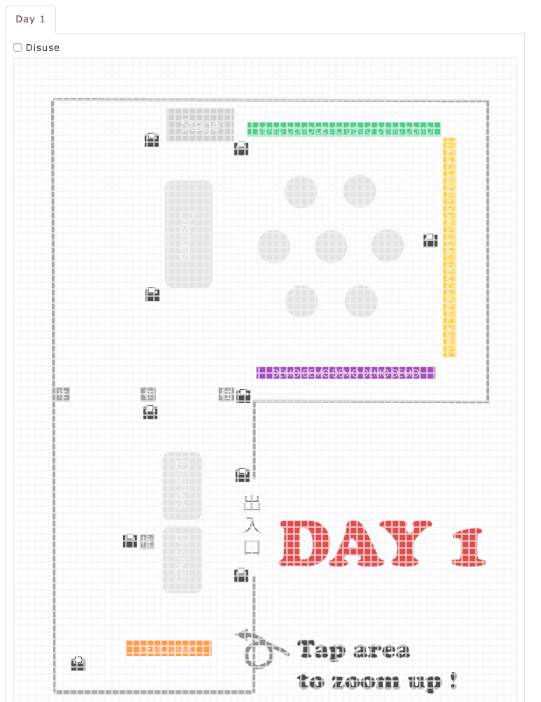

これで会場図のアップロードが完了です。


#### 2. ポスターの生成・移動・サイズ変更
会場図のアップロードが完了したら、実際にポスターにあたるポスターオブジェクトを配置していきましょう。

まずはメニューの「**Createフォーム**」内の「**Create**」ボタンを押します。

ボタンを押すと、キャンバス上にCreateフォーム内で指定した幅と高さをもつポスターオブジェクトが生成されます。

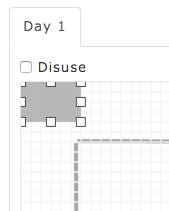

ポスターを移動させるためには、ポスターオブジェクト上（8方向の端部分を除く）を**ドラッグ&ドロップ**することで移動が可能となります。

ポスターのサイズを変更させるためには、ポスターオブジェクト上の8方向の端部分を**ドラッグ&ドロップ**することでサイズ変更が可能となります。

以上のポスターの生成・移動・サイズ変更をとおして、ポスターの配置が終われば、このステップは完了です。

以下はポスター配置イメージです。


#### 3. プレゼンテーションとの関連付け
ポスター配置が完了したら、「5. プレゼンテーション」で登録したプレゼンテーションをポスターに関連付けます。

ポスターにプレゼンテーションを関連付けさせるためには、メニューの「**Presentation**」タブを選択します。

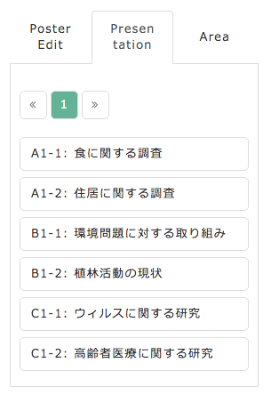

プレゼンテーションタブには、すでに登録したプレゼンテーションの一覧が表示されます。

関連付けさせたいプレゼンテーションを**ドラッグ**し

関連付けさせたいポスター上で**ドロップ**することで関連付けをおこなうことができます。

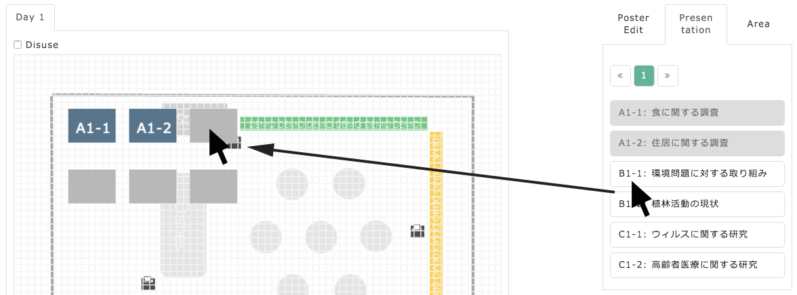

関連付けができると、ポスターオブジェクト上に関連付けしたプレゼンテーションを示す文字列が表示されます。（上の図の場合、A1-1, A1-2がそれにあたります）


#### 4. エリアの生成・移動・サイズ変更
プレンゼンテーションとの関連付けが完了したら、次にエリアの配置をおこないます。

エリアとはPosMAppにおけるタップエリアにあたります。

学会によってはポスターが何百件ものポスターセッションがある場合があるでしょう。

その際に、ポスター１つのサイズがあまりに小さくなってしまいスマートフォンからタップできないということが考えられます。

そこで、エリアを設置し、PosMApp利用者はエリアをタップすることによって、そのエリアにズームし、エリアに含まれるポスターをタップしやすくなります。

エリアの生成は、ポスターの生成とは異なり、**キャンバス上でドラッグ&ドロップ**することにより生成をおこなうことができます。

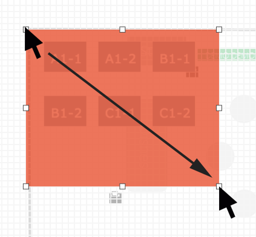

以上で、一通りのポスターに関する編集は完了です。


### 7. フロアマップ
次に、フロアマップの編集をおこないます。

フロアマップはポスターセッションの会場図とは異なり、学会の会場図つまり**建物図**にあたります。

サイドバーの「**Floor Map**」を押します。

フロアマップの編集は簡単で、1枚の画像をアップロードするだけになります。

「**Upload floor map image**」ボタンを押し、画像ファイルを選択します。

画像ファイルを選択すると、自動的にアップロードが完了します。

アップロード完了後、5秒後に再びフロアマップページに繊維します。

以下のように、PosMApp上でどのように見えるのかが表示されれば、フロアマップの編集は完了です。

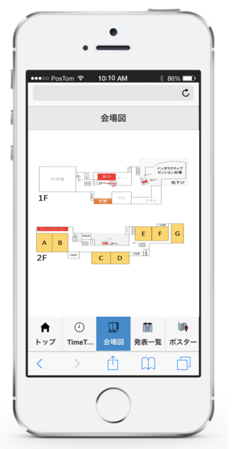


### 8. セッティング
あと少しでPosMAppの完成です。ここでは、セッティングをおこないます。

サイドバーの「**Setting**」を押します。

セッティングページでは、イベントの基本情報を編集することができます。

基本情報を編集するほかには、PosMAppのトップページの背景図となる画像をアップロードすることもできます。

ページ下部の「**Upload top page image**」ボタンを押し、画像ファイルを選択します。

フロアマップとの画像アップロードとは異なり、ここではフォームのサブミット処理である「**Upload**」ボタンを押します。

以下のように、PosMApp上でどのように見えるのかが表示されれば、セッティングの編集は完了です。

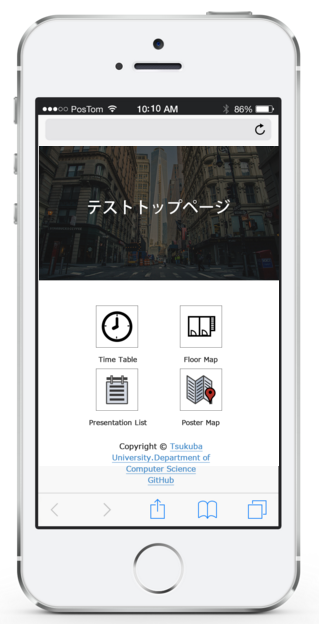


### 9. PosMAppで確認
これで、PosTom上での編集は完了しました。

最後に、実際にPosMAppで動作しているか確認してみましょう。

ダッシュボードページに戻り、「**View Your Event**」で以下のいずれかの確認方法をとります。

1. PCでの確認
2. スマートフォンでの確認

#### 1. PCでの確認
PCで確認する場合は、PCのアイコンを押します。

新規ウィンドウが開き、そのウィンドウで確認することができます。（※PosMAppはスマートフォンで利用することを前提としているため、ウィンドウサイズを縦長にすることを推奨します）

#### 2. スマートフォンでの確認
スマートフォンで確認する場合は、スマートフォンのアイコンを押します。

スマートフォンで確認するためには、「QRコードによる読み取り」または「登録メールアドレス宛にURLを送付する」のいずれかをおこなえます。

動作を確認して、問題がなさそうであれば、学会参加者へこのPosMAppのURLをシェアします。

これで、参加者がポスターセッションで迷うことはありません!


## 問い合わせ
以上、マニュアルとなります。その他、問い合わせ等ありましたら開発者までお問合せください。


## 開発チーム
筑波大学 大学院 システム情報工学研究科 コンピュータサイエンス専攻
高度IT人材育成のための実践的ソフトウェア開発専修プログラム（高度ITコース）

University of Tsukuba
Graduate School of Systems and Information Engineering
Department of Computer Science
Practical Software Development Specialization Program
for Advanced IT Personnel Training (AIT, SIT)

### 平成28年度

[鶴田 智大(Tomohiro Tsuruda)](https://github.com/ferretdayo)
[鈴木 健太郎(Kentarou Suzuki)](https://github.com/Ikuzus-k)
[杜 炎(Du Yan)](https://github.com/we333)
[钟 雨然(Zhong Yuran)](https://github.com/YRZhong)

### 平成27年度

[小串 光和(Mitsukazu Ogushi)](https://github.com/tsss-g)
[小幡 潤(Jun Obata)](https://github.com/tsss-j)
[小寺 暁久(Akihisa Kodera)](https://github.com/tsss-a)
[杜 天行(Du Tianhang)](https://github.com/tsss-t)

=======

Copyright &copy; [筑波大学CS専攻 高度ITコース](http://www.cs.tsukuba.ac.jp/ITsoft/)

Team TS_カルテット
Team TSSS
